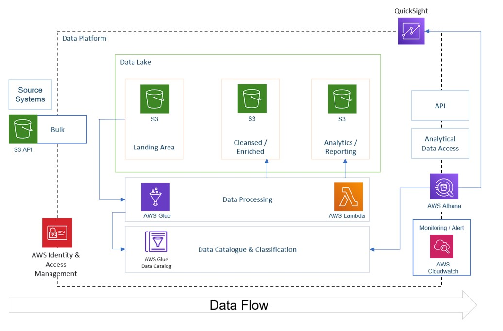

# ETL pipeline on YouTube data using Athena, Glue and Lambda

### Business Overview
Many problems exist when deploying or transferring analytics to the cloud. Differences
in features between on-premises and cloud data platforms, security, and governance
are all technical concerns. The danger of moving on-premises data into the cloud has
prompted organizations to limit cloud analytics initiatives, especially in regulated
industries where data protection is crucial. Cloud-based safe Data Lake solutions aid in
the development of rich analytics on data while classifying it into several storage
phases, such as raw, cleansed, and analytical. 

This project aims to securely manage, streamline, and perform analysis on the structured and semi-structured YouTube videos
data based on the video categories and the trending metrics.

### Dataset Description
This Kaggle dataset contains statistics (CSV files) on daily popular YouTube videos over
the course of many months. There are up to 200 trending videos published every day
for many locations. The data for each region is in its own file. The video title, channel
title, publication time, tags, views, likes and dislikes, description, and comment count
are among the items included in the data. A category_id field, which differs by area, is
also included in the JSON file linked to the region.

### Tech Stack
➔ Languages SQL, Python3
➔ Services AWS S3, AWS Glue, QuickSight, AWS Lambda, AWS Athena, AWS IAM

### Key Takeaways
Understanding the project Overview and Architecture
● Understanding ETL on Big Data
● Introduction to Staging and Data Lake
● Creating IAM Roles and Policies
● Creating Lambda Functions
● Setting up Glue Jobs for ETL
● Using Glue Crawler and Glue Studio
● Creating Glue Data Catalog
● Converting JSON to Parquet format
● Performing Data Transformations and Joins
● Visualizing in QuickSight

### Architecture

